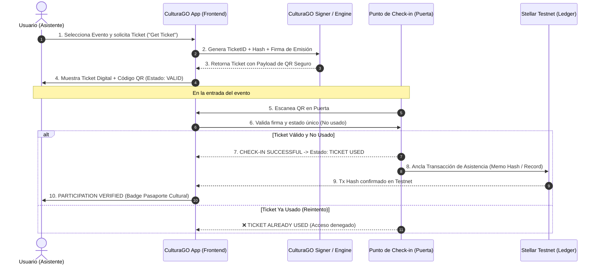

# System Architecture — CulturaGO Tickets

Este documento describe la arquitectura técnica propuesta y el ciclo de vida del ticket cultural en Stellar.

---

## 🏛️ 1. Diagrama de Flujo (Mermaid)



---

## 🔒 2. Seguridad del QR y Prevención de Doble Uso

1. **Payload del QR**:
   ```json
   {
     "ticketId": "CG-SBN-2026-8841",
     "eventId": "stellar-builder-night",
     "timestamp": 1787268000,
     "signature": "3045022100...ed25519"
   }
   ```
2. **Sin Secretos en el QR**: El QR contiene únicamente identificadores públicos y una firma criptográfica verificable. No almacena claves privadas ni datos sensibles.
3. **Atomic State & Single-Use Lock**: Una vez validado en el check-in, el identificador pasa al estado inmutable `USED` tanto en memoria de aplicación como registrado en el Ledger de Stellar. Cualquier lectura posterior es rechazada de inmediato.

---

## 🌐 3. Integración Futura con Pasaporte Cultural

* **Soulbound Tokens (SBTs) / Proof of Attendance**: Cada transacción de participación en Stellar constituye un sello digital en el Pasaporte Cultural del usuario.
* **Smart Accounts & Passkeys**: Migración transparente hacia cuentas controladas por Passkey (WebAuthn) cuando el usuario desee exportar sus sellos o canjear beneficios culturales.
