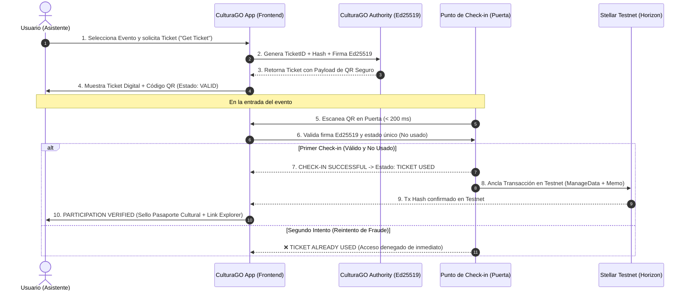

# System Architecture — CulturaGO Tickets

Este documento detalla la arquitectura técnica, el ciclo de vida del ticket cultural y la integración con Stellar Testnet.

---

## 🏛️ 1. Diagrama de Flujo (Mermaid)



---

## 🔒 2. Seguridad del QR y Prevención de Doble Uso

### A. Payload Seguro en Código QR
El QR contiene exclusivamente metadatos públicos y la firma criptográfica del emisor:
```json
{
  "ticketId": "CG-SBN-8841",
  "eventId": "sbn-2026-culturago",
  "attendeeName": "Alex Valenzuela",
  "issuedAt": 1787268000000,
  "nonce": "k9x82z",
  "authorityPublicKey": "GBSVCV6OCMAVY2T5AQFPLAM6BTZSIIN3WBWNG2MA6TPK5MI6AZAHAMSM",
  "signature": "3d2638ab593f60a30b0d65e9a15d61d2..."
}
```
* **Sin Secretos**: Nunca se almacenan llaves privadas (`S...`) ni credenciales confidenciales en el QR o en el cliente.
* **Verificación de Emisor Confiable (Trusted Issuer)**: El validador en puerta no confía en `authorityPublicKey` recibido dentro del QR; verifica explícitamente que coincida con la clave pública autorizada de CulturaGO (`getTrustedAuthorityPublicKey()`) antes de validar la firma criptográfica Ed25519.

### B. Máquina de Estados y Prevención de Reúso
1. **Estado Inicial**: `VALID`.
2. **Check-in 1**: Cambia atómicamente a `USED` con marca de tiempo `usedAt`.
3. **Check-in 2 (o posteriores)**: La condición `ticket.status === 'USED'` intercepta el escaneo en milisegundos y responde `TICKET ALREADY USED` con acceso denegado.

> **Nota de Arquitectura sobre Almacenamiento**:
> En este MVP, el estado de uso se gestiona mediante la interfaz `ITicketRepository` (implementada en memoria para la demo). El diseño está modularizado para que en producción pueda reemplazarse por una base de datos transaccional con réplica o un contrato inteligente en Soroban. El almacenamiento local no se presenta como mecanismo de seguridad final; la seguridad descansa en la firma Ed25519 y en el anclaje inmutable en Stellar Testnet.

---

## 🌌 3. Anclaje en Stellar Testnet (Proof of Attendance)

Tras el check-in exitoso en puerta, se genera y envía una transacción real a **Stellar Testnet Horizon**:
* **Source Account**: Cuenta de la Autoridad de CulturaGO (patrocina comisiones / fee sponsorship).
* **Operation**: `Operation.manageData({ name: 'ATT_' + ticketId, value: 'OK:...' })`.
* **Memo**: `Memo.text('CG:' + ticketId)`.
* **Manejo de Estados de Red**:
  * Si la transacción se confirma: Estado `CONFIRMED`, `txHash` público y enlace directo a `https://stellar.expert/explorer/testnet/tx/{txHash}`.
  * Si Horizon está inaccesible o pendiente: Estado `STELLAR_UNAVAILABLE` o `ANCHOR_PENDING`. **No se generan hashes simulados ni enlaces rotos al explorer**; el acceso del asistente en puerta permanece válido.

---

## 🎟️ 4. Evolución: Pasaporte Cultural de CulturaGO

Las pruebas de asistencia registradas en Stellar actúan como sellos verificables para el Pasaporte Cultural:
* **Fidelización y Puntos**: Acumulación de insignias por asistencia a eventos culturales.
* **Transición a Smart Wallets con Passkeys (WebAuthn)**: Siguiendo las directrices descubiertas en **Raven MCP**, el usuario podrá autenticarse con biometría (FaceID/TouchID) para reclamar recompensas y transferir beneficios sin gestionar llaves criptográficas complejas.
